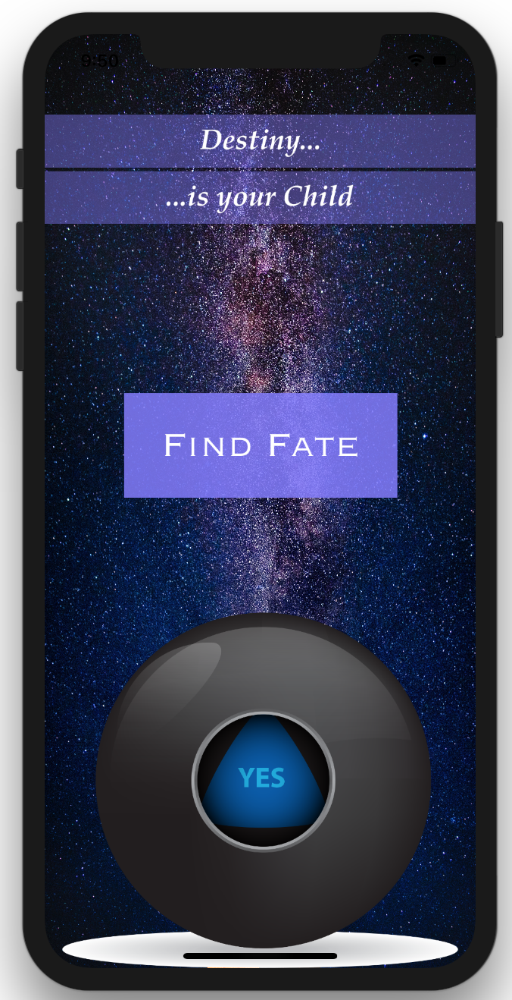

## Magic Ballz
* A simple SPA made with Xcode 9 and Swift 4.
* A basic demonstration of fundamental aspects within the Xcode environment.

#### Usage
* Clone and open project in Xcode
* Click Build, and open on a Device or Simulator
* Once the app has loaded, As a very deep, personal, and important question to yourself.
* Click on the only button to determine your destiny.
* If you don't like the answer, simply click again to reshape your fortune.

#### Screen Shot

